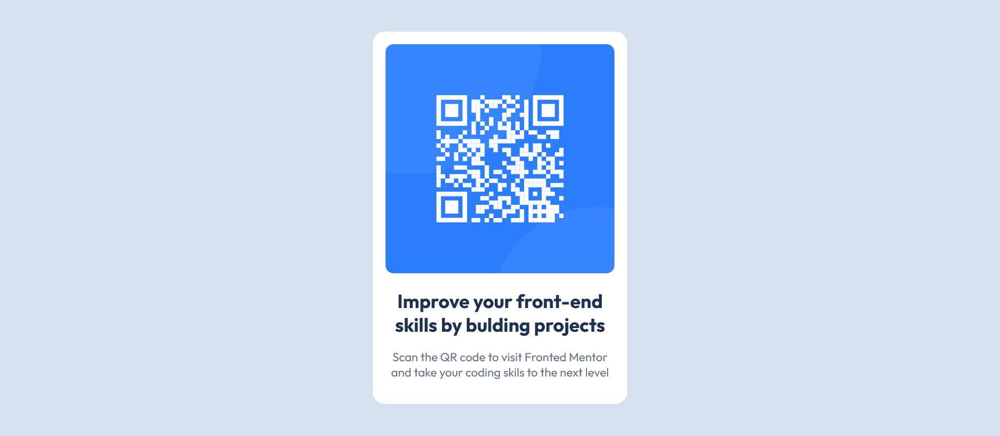

# Frontend Mentor - QR code component solution

This is a solution to the [QR code component challenge on Frontend Mentor](https://www.frontendmentor.io/challenges/qr-code-component-iux_sIO_H). Frontend Mentor challenges help you improve your coding skills by building realistic projects. 

## Table of contents

- [Overview](#overview)
  - [Screenshot](#screenshot)
  - [Links](#links)
- [My process](#my-process)
  - [Built with](#built-with)
  - [What I learned](#what-i-learned)
  - [Continued development](#continued-development)
  - [Useful resources](#useful-resources)
- [Author](#author)
- [Acknowledgments](#acknowledgments)


## Overview

### Screenshot




### Links
- Solution URL: https://github.com/shahadm11/QR-code-Challenge
- Live Site URL: https://shahadm11.github.io/QR-code-Challenge/

## My process

### Built with

- Semantic HTML5 markup
- CSS3
- Flexbox
- Google Fonts (Outfit)


### What I learned

- Learned how to center content vertically and horizontally using Flexbox.
- Practiced semantic HTML and structuring a card component.
- Styled a responsive QR code card using CSS and Google Fonts.


```html
  <link rel="preconnect" href="https://fonts.googleapis.com">
  <link rel="preconnect" href="https://fonts.gstatic.com" crossorigin>
  <link href="https://fonts.googleapis.com/css2?family=Outfit:wght@400;700&display=swap" rel="stylesheet">
```
```css
body{
    background-color: hsl(212, 45%, 89%);
    display: flex;
    font-family: "Outfit", sans-serif;
    align-items: center;
    justify-content: center;
}

.card{
    background-color: white;
    border-radius: 15px;
    padding: 1rem;
    max-width: 370px;
    text-align: center;
    margin: 10%;
}
```

### Continued development

- Improve responsiveness for smaller screens.
- Experiment with CSS variables for colors and spacing.
- Learn CSS Grid to enhance layout skills.


### Useful resources

- [Frontend Mentor](https://www.frontendmentor.io) - Practice challenges and design files.


## Author

- Frontend Mentor - [@shahadm11](https://www.frontendmentor.io/profile/shahadm11)

